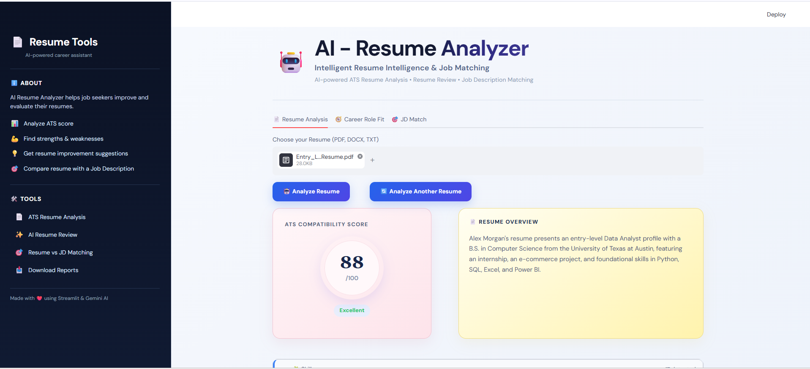
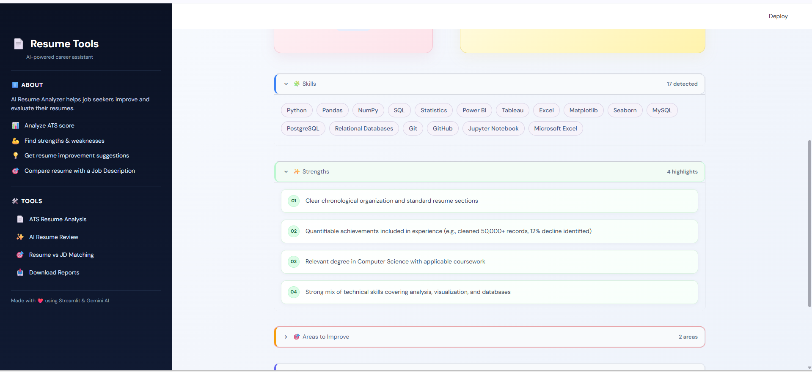
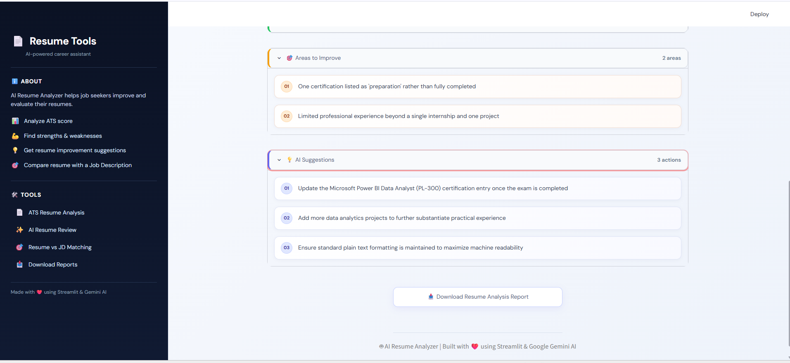
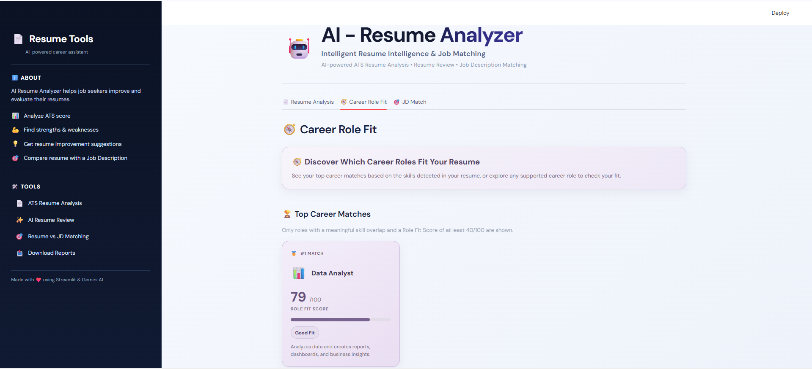
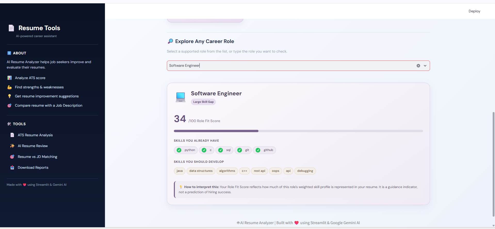
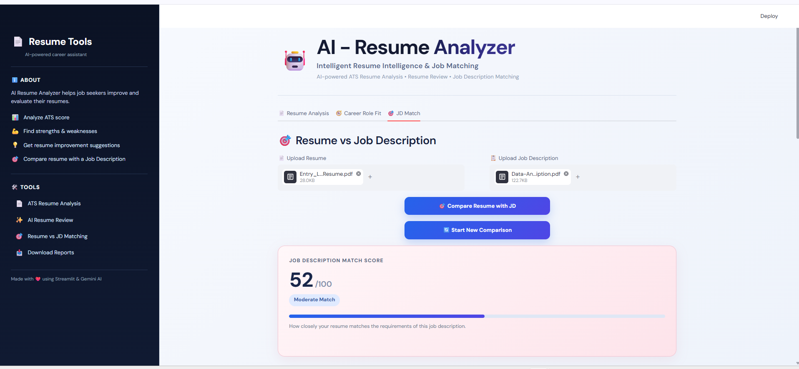
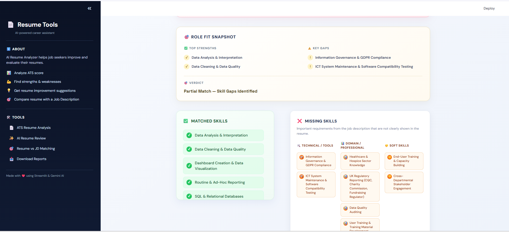
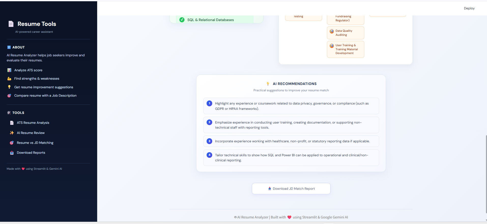

# AI Resume Analyzer

An AI-powered Resume Analyzer built with Python, Streamlit, and Google Gemini. The application analyzes resumes, evaluates ATS compatibility, suggests suitable career roles, and compares a resume against a Job Description.

## ✨ Features

### 📄 Resume Analysis

- Upload resumes in PDF, DOCX, or TXT format
- Validate whether the uploaded document is actually a resume
- Generate an ATS compatibility score
- Provide a resume overview
- Detect relevant skills
- Identify strengths
- Highlight areas for improvement
- Generate AI-powered suggestions

### 🎯 Career Role Fit

- Analyze the resume against supported career roles
- Display the top suitable career roles
- Provide a role-fit score
- Show skills already present in the resume
- Show skills that need to be developed
- Provide a description of each matched role
- Explore supported career roles manually
- Display a message when no suitable role is identified

### 🔍 Resume vs Job Description Matching

- Upload a resume and Job Description
- Validate both uploaded documents
- Calculate a Job Description match score
- Identify matched skills
- Identify missing skills
- Categorize skills into:
  - Technical Skills
  - Domain Skills
  - Soft Skills
- Provide an overall match verdict
- Generate AI-powered recommendations

## 🛠️ Tech Stack

- **Python**
- **Streamlit**
- **Google Gemini API**
- **PyPDF**
- **python-docx**
- **python-dotenv**
- **HTML/CSS**

## 📁 Project Structure

```text
AI-Resume-Analyzer/
│
├── assets/
│   ├── Screenshots/
│   └── style.css
│
├── prompts/
├── reports/
├── resumes/
├── services/
├── uploads/
├── utils/
│
├── .gitignore
├── README.md
├── requirements.txt
└── app.py
```

## 📸 Screenshots

### 📄 Resume Analysis







### 🎯 Career Role Fit





### 🔍 Resume vs Job Description Matching







## 🚀 How to Run

### 1. Clone the repository

```bash
git clone https://github.com/Samrudha-SV/AI-Resume-Analyzer.git
```

### 2. Navigate to the project folder

```bash
cd AI-Resume-Analyzer
```

### 3. Create a virtual environment

```bash
python -m venv .venv
```

### 4. Activate the virtual environment

#### Windows

```bash
.venv\Scripts\activate
```

#### macOS / Linux

```bash
source .venv/bin/activate
```

### 5. Install dependencies

```bash
pip install -r requirements.txt
```

### 6. Create the environment file

Create a file named `.env` in the project root directory and add your Google Gemini API key:

```env
GOOGLE_API_KEY=your_google_gemini_api_key
```

> ⚠️ Never commit the `.env` file or expose your API key publicly.

### 7. Run the application

```bash
streamlit run app.py
```

The application will open in your browser at:

```text
http://localhost:8501
```

## 🔐 Environment Variables

The application requires the following environment variable:

```text
GOOGLE_API_KEY
```

Store the API key in the `.env` file. Never upload the API key to GitHub.

## 💡 Usage

1. Start the Streamlit application.
2. Upload a resume.
3. Analyze the resume to view the ATS score, resume overview, skills, strengths, areas for improvement, and AI suggestions.
4. Explore suitable career roles using Career Role Fit.
5. Upload a Job Description to compare it with the resume.
6. Review the match score, matched skills, missing skills, verdict, and AI recommendations.

## 👤 Author

**Samrudha SV**

GitHub: https://github.com/Samrudha-SV
